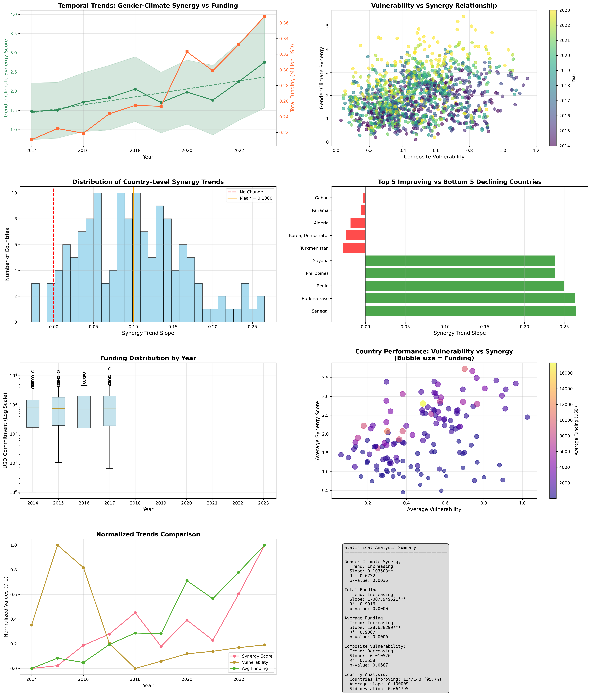
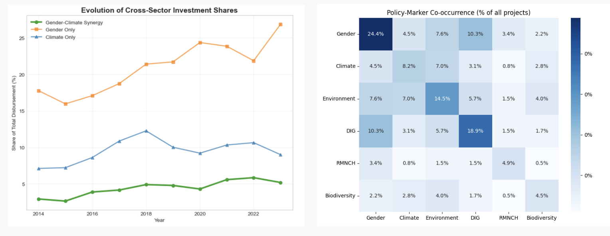
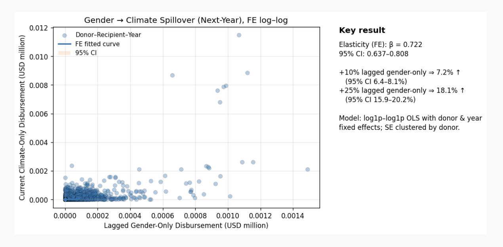

# UNDP Hackathon: Data Analysis on Gender × Climate Integration

## 1. Overview
This project develops a reproducible data analytics pipeline to analyze gender–climate integration in Official Development Assistance (ODA). It integrates multi-source datasets and applies statistical modeling, network analysis, and machine learning to uncover cross-sector funding patterns.

## 2. Objective
- Analyze integration between gender and climate funding  
- Identify cross-sector relationships in development aid  
- Quantify spillover effects and funding dynamics  
- Develop a reproducible data analysis pipeline  

## 3. Dataset
- Primary: OECD CRS dataset  
- Secondary: CCVI, ND-GAIN, UNDP HDR, World Bank indicators
- Type: Tabular + time-series + socio-economic indicators  
- Scale: 145 countries × 10 years (~1,450 observations)  
- Features:
  - Financial metrics (commitment, disbursement)  
  - Gender and climate markers  
  - Socio-economic and vulnerability indices  

## 4. Data Processing
- Multi-source data integration and harmonization  
- Missing value handling and interpolation  
- Feature engineering:
  - Gender–climate synergy index  
  - Composite vulnerability indicators  
  - Temporal lag features  
- Dataset transformation for analysis-ready format  

## 5. Analytical Approach
- Exploratory Data Analysis (EDA)  
- Fixed-effects regression for spillover analysis  
- Network analysis (donor-recipient relationships)  
- Clustering and time-series modeling  
- Feature importance and pattern discovery  

### Time-Series Analysis


## 6. Results 
- Low integration: ~4–5% of projects include both gender and climate markers  
- Positive spillover: gender funding increases future climate funding  
- Integration signals exist but are underrepresented in structured data  

### Cross-Sector Relationships


### Spillover Effects


## 7. Reproducibility
- Modular preprocessing scripts  
- Multi-dataset integration pipeline  
- Defined feature engineering steps  
- Notebook-based end-to-end analysis  
- Structured repository with reusable components  

## 8. How to Run
Install dependencies and run notebooks sequentially:

```bash
pip install -r requirements.txt
```
## 9. Tech Stack
Python, Pandas, NumPy, Statsmodels, scikit-learn, Network Analysis, Time-Series Modeling

## 10. Team and Contribution
This project was developed as part of the UNDP Data Drive Hackathon.

Personal Contributions:
- Data Analysis
- Data Integration & Feature Engineering
- Visualization
- Project Management
- Client Communication
