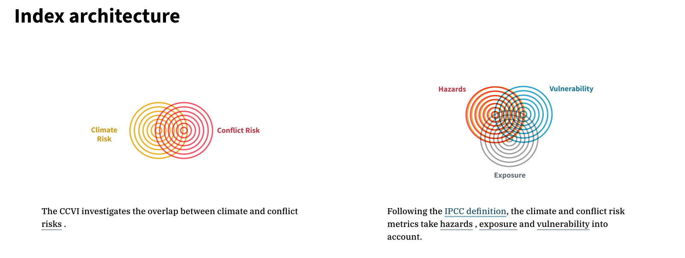
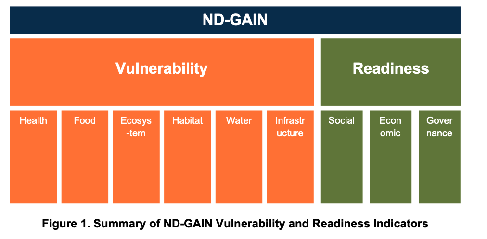
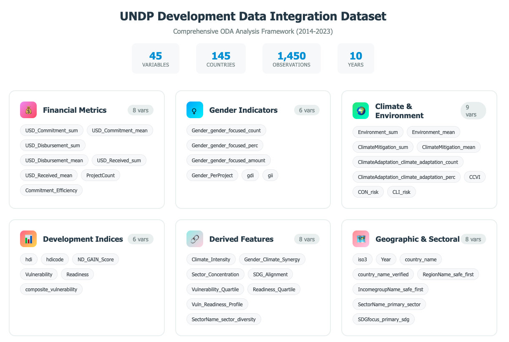

# UNDP Data Analysis Challenge 2025 - Gender X Climate: Predictive Analysis for Cross-Sector Aid Synergies

## Project Overview

Climate change and gender inequality are two of the most pressing challenges of our time, yet development funding continues to address them in isolation. Despite international frameworks like the 2015 Paris Agreement calling for gender-responsive climate action, and the UN Sustainable Development Goals explicitly linking **Gender Equality (SDG 5)** and **Climate Action (SDG 13)**, only **4.7%** of all donor-funded projects currently integrate both climate and gender markers.

This represents a massive missed opportunity. Our analysis reveals that development projects addressing both climate resilience and gender equality simultaneously create **compounding benefits** that are more sustainable, transformative, and cost-effective than siloed approaches.


### The Synergy Concept

**Climate x Gender Synergy** refers to development interventions that improve both **climate resilience** and **gender equality** simultaneously. Examples include:

- **Solar energy projects** that reduce emissions while creating employment opportunities for women in rural areas  
- **Clean water initiatives** that address climate-related drought impacts and reduce the time burden on women for water collection  
- **Climate-smart agriculture programs** that help women farmers adapt to climate change while boosting their economic empowerment  


### Our Solution

We have developed a comprehensive **predictive analytics framework** that:

- **Quantifies cross-sector synergies** using historical funding patterns and outcomes data  
- **Predicts donor-recipient funding dynamics** to identify high-potential collaboration opportunities  
- **Provides evidence-based recommendations** for optimizing aid allocation strategies  
- **Visualizes impact** through interactive dashboards highlighting underutilized funding corridors  

Our preliminary analysis demonstrates that a **10% increase in gender-focused aid** correlates with a **~7.2% rise in climate funding** in the subsequent year — suggesting that hybrid projects offer **significant untapped potential** for achieving sustainable development impact.

---

### Repository structure

```bash
UNDP_data_analysis_2025/
├── README.md
├── requirements.txt
├── assets/
├── data/
│   ├── README.md
│   ├── raw/
│   │   ├── aid_data/
│   │   ├── ccvi/
│   │   ├── crs/
│   │   ├── nd_gain/
│   │   └── undp_hdr/
│   ├── processed/
│   │   ├── ccvi/
│   │   ├── crs/
│   │   ├── ng_gain/
│   │   └── undp_hdr/
│   └── final_composed/
├── src/
│   ├── ml/
│   └── preprocessing/
├── notebooks/
│   ├── undp_aid_data_eda_modelling.ipynb
│   └── undp_recipient_analysis.ipynb
├── docs/
│   └── data_aggregation_strategies.md
└── results/
   ├── country_clustering_analysis.png
   └── time_series_analysis.png
```


## 🛠️ Setup Instructions

Before running any preprocessing steps or analytics, follow these setup instructions:


### 1. Install Dependencies

Make sure you have Python 3.8+ installed. Then install the required Python packages:

```bash
pip install -r requirements.txt
```

### 2. Download Base Dataset: OECD CRS
Our pipeline depends on the OECD Creditor Reporting System (CRS) dataset as the primary base.
You can download it manually from: OECD CRS Direct Download
Save the downloaded CSV or Excel file to the following directory:

`data/raw/crs`

### 3.  Preprocessing: Individual Datasets
Run the following preprocessing scripts to clean and harmonize each external dataset. Each script loads raw data from /data/raw/ and outputs processed data to /data/processed/.
- Climate Change Vulnerability Index (CCVI)
bashpython src/preprocessing/ccvi_preprocessing.py

Raw file location: `/data/raw/ccvi/`
Output: Processed country-level CCVI index

-  Notre Dame Global Adaptation Index (ND-GAIN)
bashpython `src/preprocessing/nd_gain_preprocessing.py`

Raw file location: `/data/raw/nd_gain/`
Output: Yearly resilience and vulnerability scores by country

-  UNDP Human Development Report (HDR)
bashpython `src/preprocessing/undp_hdr_preprocessing.py`


## Analysis Methodology

Our analytical approach combines multiple complementary techniques to understand and predict cross-sector aid synergies:


### 1. Data Integration & Feature Engineering

- **Multi-source integration**:  
  OECD CRS primary dataset enhanced with UNDP HDR, ND-GAIN, and CCVI indicators.  
  📁 For details, see [Composed Aggregated Dataset Documentation](docs/data_aggregation_strategies.md)

- **Synergy metrics calculation**:  
  Development of composite indices measuring climate-gender integration.

- **Temporal feature creation**:  
  Lag variables and growth rates used to capture spillover effects.  

  📁 Data processing steps: [UNDP - Recipient Data Analysis & Feature Engineering](notebooks/undp_recipient_analysis.ipynb)


### 2. Network Analysis

- **Donor-recipient relationship mapping**:  
  Hub-to-hub linkage analysis to reveal collaboration patterns.

- **Cross-cluster overlap quantification**:  
  Measuring connectivity between climate and gender funding networks.

- **Concentration indices**:  
  Herfindahl-Hirschman Index (HHI) used to analyze funding distribution patterns.

  📁 Methodology: [Aid Donor Network Analysis](notebooks/undp_aid_data_eda_modelling.ipynb)


### 3. Spillover Effect Analysis

- **Fixed-effects regression models**:  
  Controls for donor and year to isolate true spillover effects.

- **Lag correlation analysis**:  
  Evaluates temporal dependencies between gender and climate funding.

- **Recipient-level analysis**:  
  Country-specific modeling of spillover magnitudes.

  📁 Complete analysis: [Climate X Gender Spillover Analysis](notebooks/undp_aid_data_eda_modelling.ipynb)


### 4. Vulnerability-Synergy Mapping

- **Geospatial analysis**:  
  Maps synergy scores against regional vulnerability indices.

- **Priority targeting**:  
  Identifies high-impact intervention zones in underfunded regions.

- **Country classification**:  
  Readiness-vulnerability matrix used for strategic allocation planning.

  📁 Geographic methods: [Geographic Analysis](notebooks/undp_recipient_analysis.ipynb)


### 5. Predictive Modeling & Clustering

- **Machine learning pipelines**:  
  Advanced ML models used for predicting future synergy-optimized allocations.

- **Cross-validation frameworks**:  
  Time-based validation to ensure robust model performance.

- **Feature importance analysis**:  
  Highlights key drivers of successful gender-climate integrated aid.

  📁 Code:  
  - [Clustering](src/ml/clustering.py)  
  - [Regression Model](notebooks/undp_recipient_analysis.ipynb)
  - [Time Series Analysis](src/ml/time_series_analysis.py)

  Results:  
  - [Clustering Results](results/country_clustering_analysis.png)  
  - [Time Series Forecasting](results/time_series_analysis.png)

---

## Datasets Choice Justification

### Primary Dataset

**OECD Development Assistance Committee Creditor Reporting System (DAC-CRS)**

The OECD DAC-CRS serves as our foundational dataset, providing the most comprehensive and standardized repository of Official Development Assistance (ODA) flows globally. This dataset was selected as our primary source for several critical reasons:

- **Comprehensive Coverage**: Project-level data spanning 2014-2023 with detailed financial flows, sector classifications, and policy markers
- **Standardized Methodology**: Consistent reporting standards across all OECD donor countries ensure data comparability
- **Rich Contextual Variables**: Includes gender markers, climate adaptation/mitigation flags, and SDG alignment indicators essential for our synergy analysis
- **Recipient-Focused Structure**: Enables aggregation by recipient country and year, aligning with our analytical framework

**For details about the data aggregation and advanced feature extractions please refer to the documentation provided in the [Data Aggregation Strategies Guide](docs/data_aggregation_strategies.md)**

**Key Variables Extracted:**
- Financial metrics: `USD_Commitment`, `USD_Disbursement`, `USD_Received`
- Policy markers: `Gender_Marker`, `Climate_Adaptation_Marker`, `Climate_Mitigation_Marker`
- Sectoral information: `Sector_Code`, `Sector_Name`, `SDG_Focus`
- Geographic identifiers: `Recipient_Code`, `Recipient_Name`, `Region`

### Secondary Datasets

Our multi-dimensional approach integrates four complementary datasets to create a holistic view of development cooperation effectiveness:

#### 1. Climate Conflict Vulnerability Index (CCVI) 


**Rationale**: CCVI provides standardized climate risk assessments crucial for understanding the environmental context of aid allocation decisions.

**Key Components**:
- **Exposure**: Physical manifestation of climate change
- **Sensitivity**: Degree to which systems are affected by climate stimuli
- **Adaptive Capacity**: Ability to adjust to climate change effects

**Integration Value**: Enables analysis of whether climate-vulnerable countries receive proportionate climate-focused aid, supporting evidence-based allocation recommendations.

#### 2. UNDP Human Development Reports (HDR)

**Rationale**: HDR indicators provide essential baseline measurements of recipient country development status and gender equality progress.

**Key Indicators**:
- **Human Development Index (HDI)**: Composite measure of life expectancy, education, and income
- **Gender Inequality Index (GII)**: Reproductive health, empowerment, and labor market participation
- **Gender Development Index (GDI)**: HDI values calculated separately for males and females

**Integration Value**: Enables correlation analysis between development baselines and aid effectiveness, particularly for gender-focused interventions.

#### 3. ND-GAIN Climate Vulnerability and Readiness Index
*

**Rationale**: Provides a comprehensive assessment framework combining vulnerability with adaptive capacity, essential for understanding recipient countries' ability to utilize climate-focused aid effectively.

**Dual Framework**:
- **Vulnerability Score**: Exposure, sensitivity, and adaptive capacity across six sectors
- **Readiness Score**: Economic, governance, and social readiness to leverage investment

**Integration Value**: Creates vulnerability-readiness matrices enabling sophisticated climate aid allocation analysis and effectiveness predictions.

#### 4. Additional Development Indicators
**World Bank Development Indicators** and **IMF Economic Data** supplement our core datasets with:
- Macroeconomic context (GDP growth, inflation, debt levels)
- Population demographics and urbanization trends
- Infrastructure development indicators

### Data Processing Methods

#### Stage 1: Individual Dataset Preparation

**CRS Data Aggregation**:
```python
# Country-year aggregation strategy
agg_dict = {
    'USD_Commitment': ['sum', 'mean'],
    'Gender': [('gender_focused_perc', lambda x: (x == 1).mean())],
    'ClimateAdaptation': [('climate_adaptation_count', lambda x: (x == 1).sum())],
    'SectorName': [('sector_diversity', 'nunique')]
}
```

**Temporal Alignment**:
- Created complete country-year grid (145 countries × 10 years = 1,450 observations)
- Applied linear interpolation for missing values within 2-year gaps
- Used regional median imputation for structural missing data

#### Stage 2: Multi-Dataset Integration

**Geographic Harmonization**:
- Standardized all datasets to ISO3 country codes
- Validated geographic coverage ensuring 145 recipient countries maintained
- Cross-referenced country name variations and resolved inconsistencies

**Temporal Synchronization**:
- Aligned all datasets to annual frequency (2014-2023)
- Handled different reporting cycles through forward-fill and interpolation methods
- Maintained data quality flags for interpolated values

#### Stage 3: Feature Engineering for Advanced Analytics

**Composite Indicators**:
```python
# Gender-Climate Synergy Index
df['Gender_Climate_Synergy'] = (
    df['Gender_Focus_Perc'] * 
    df['Climate_Intensity'] * 
    np.log1p(df['USD_Commitment_sum'])
)

# Composite Vulnerability Score
df['composite_vulnerability'] = (
    0.4 * df['CCVI_normalized'] + 
    0.3 * df['Vulnerability_normalized'] + 
    0.3 * df['CON_risk_normalized']
)
```

**Analytical Readiness Features**:
- **Efficiency Metrics**: Commitment-to-disbursement ratios, per-capita investment calculations
- **Temporal Features**: Year-over-year growth rates, trend indicators
- **Categorical Encodings**: Vulnerability quartiles, readiness classifications

### Justification for Recipient-Focused Architecture

Our dataset architecture prioritizes **recipient countries** as the primary analytical unit, enabling:

1. **Dashboard Development**: Country-centric visualizations showing aid effectiveness across multiple dimensions
2. **Geospatial Analysis**: Map-based representations of vulnerability, aid flows, and synergy scores
3. **Machine Learning Applications**: Predictive modeling for aid allocation optimization and effectiveness forecasting
4. **Comparative Analysis**: Cross-country benchmarking and regional trend identification

This comprehensive integration creates a unique analytical asset combining:
- **Breadth**: 145 countries across 10 years (1,450 observations)
- **Depth**: 47 variables spanning financial, social, environmental, and governance dimensions
- **Quality**: Standardized, validated, and analysis-ready format optimized for advanced analytics



The resulting dataset enables sophisticated development cooperation analysis not possible with individual data sources, supporting evidence-based policy recommendations and strategic aid allocation decisions.

---

## Key Findings 

### 1. Massive Synergy Gap

- Only **4.5%** of CRS projects currently integrate both **gender** and **climate** markers.
- Despite a **60.7% cross-cluster overlap** among donor hubs, the **low pair concentration (0.036)** suggests untapped corridors for collaboration.
- Most top-linked donor hubs are under-tagged:
  - Only **2** belong to climate-leaning clusters.
  - Just **1 hub** leads in co-benefit (climate + gender) funding.


### 2. Significant Spillover Effects

- A **10% increase in gender-focused disbursements** is associated with a **~7.2% increase in climate funding** in the following year.
- **Lagged gender funding** outperforms concurrent funding as a predictor of future climate disbursements at the recipient level.
- Spillover effects remain **large and statistically significant** even after controlling for **donor identity** and **year-fixed effects**.


### 3. Strategic Opportunity Mapping

- **Bangladesh** emerges as a **high-priority intervention target**:
  - It has **high vulnerability** and an **unusually strong climate-gender synergy score**, indicating greater impact potential for integrated projects.
- **Climate disbursements** have historically outpaced **gender-focused funding**, revealing **rebalancing opportunities**.
- **Hub-to-hub collaboration analysis** shows major donor networks with **unexploited potential** for synergy-based co-funding.


### 4. Funding Pattern Insights

- Persistent **gender-climate funding gaps** are evident across multiple regions over time.
- Network analysis uncovers a **high concentration of funding** in select donor-recipient corridors.
- **Vulnerability-synergy mapping** highlights a **misalignment** between **regions of need** and current **project allocations**.


---

## Technical Decisions

### Data Architecture

- Recipient-focused dataset structure enabling country-centric analysis and dashboard development  
- Parquet format optimization for efficient data processing and scalable analytical workflows  
- Comprehensive feature engineering process producing over 45 analytical variables from four primary data sources  

### Modeling Framework

- Fixed-effects regression selected for spillover analysis to account for unobserved heterogeneity across countries and time  
- Network analysis metrics (e.g., assortativity, HHI concentration) employed to quantify collaboration structures and funding distribution  
- Composite vulnerability indices developed by integrating multiple environmental and socio-economic risk assessment frameworks  

### Visualization Strategy

- Interactive geospatial mapping to visualize the intersection between vulnerability and climate-gender synergy  
- Network diagrams depicting donor-recipient collaboration and funding pathways  
- Time-series analysis tools to highlight lag effects and temporal dynamics in funding allocations  

### Technology Stack

- Python ecosystem:
  - **Pandas**, **Statsmodels**, **Scikit-learn** for data processing, statistical modeling, and machine learning  
- Jupyter Notebooks for transparent and reproducible analytics workflows  
- AI-assisted development tools (e.g., ChatGPT, Claude) integrated into the data cleaning, debugging, and code generation workflow  

---

## Future Possibilities: Phase 2 Development (8-Week Timeline)

### Weeks 1–2: Stakeholder Integration & Requirements

- Conduct stakeholder interviews with UNDP teams  
- Align goals with end-user feedback and policy priorities  
- Implement an enhanced project management framework  
- **Deliverable**: Unified feature matrix and stakeholder-validated project scope  

### Weeks 3–5: Advanced Analytics Development

- Extend machine learning models with ensemble methods and neural networks and explainable AI 
- Incorporate causal inference frameworks for more accurate spillover estimation  
- Develop real-time model update mechanisms for dynamic funding predictions  
- **Deliverable**: Production-ready predictive models and pipelines  

### Weeks 6–7: Interactive Platform Development

- Design and build a web-based dashboard for scenario analysis  
- Develop “what-if” tools for simulating policy and funding scenarios  
- Ensure cross-device compatibility for use in the field  
- **Deliverable**: Fully functional and responsive analytics platform  

### Week 8: Deployment & Knowledge Transfer

- Pilot deployment with selected UNDP country offices  
- Conduct user onboarding and training sessions  
- Prepare system documentation and handover plans  
- **Deliverable**: Deployed, validated system with clear integration roadmap  


--- 

### References

1. OECD (2024). *Creditor Reporting System (CRS)*. OECD Development Assistance Committee. Available at: https://www.oecd.org/dac/financing-sustainable-development/development-finance-standards/

2. Chen, C., et al. (2015). *ND-GAIN Country Index*. University of Notre Dame Global Adaptation Initiative. Available at: https://gain.nd.edu/our-work/country-index/

3. UNDP (2024). *Human Development Reports*. United Nations Development Programme. Available at: https://hdr.undp.org/data-center

4. Muttarak, R., & Lutz, W. (2014). Is education a key to reducing vulnerability to natural disasters and hence unavoidable climate change? *Ecology and Society*, 19(1).

5. World Bank (2024). *World Development Indicators*. Available at: https://databank.worldbank.org/source/world-development-indicators

