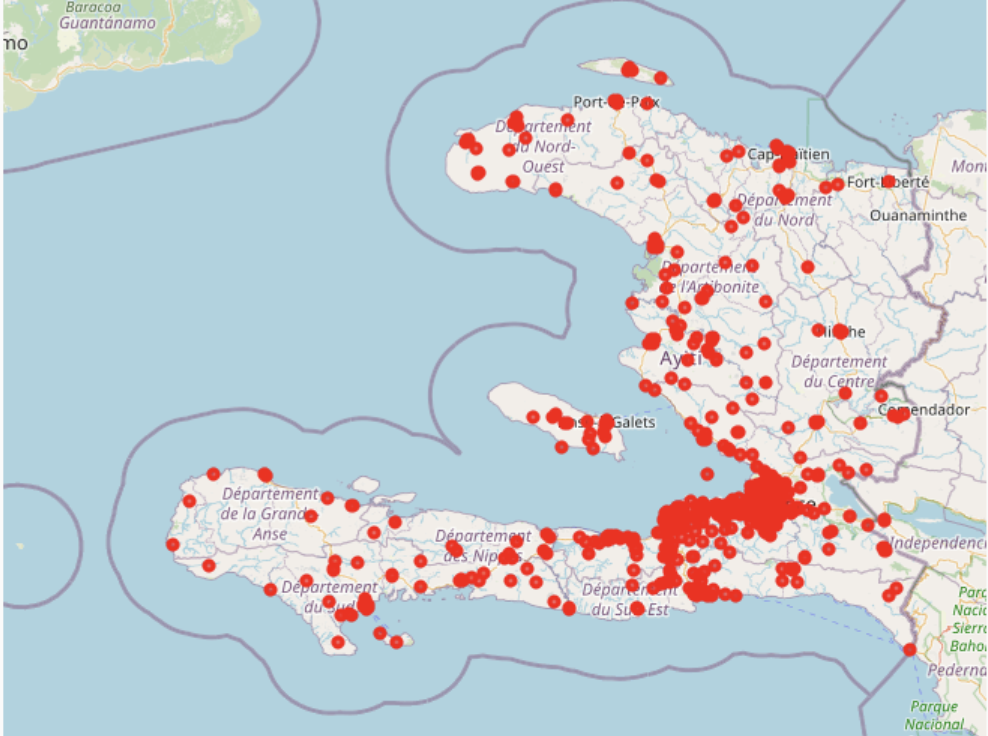
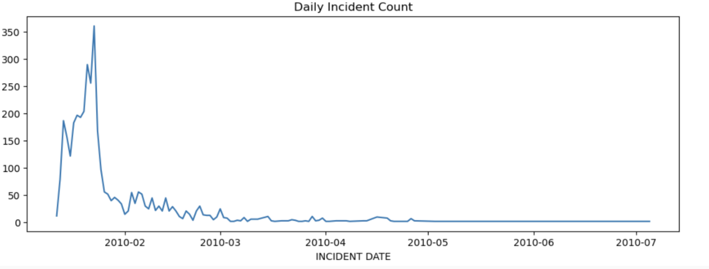
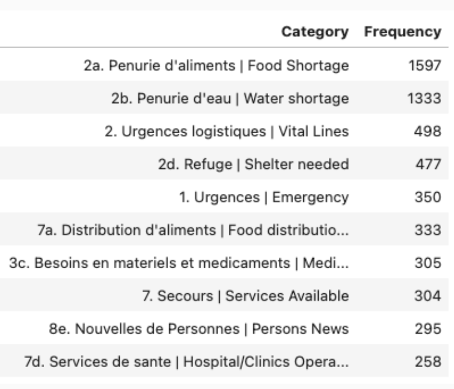

# Haiti Earthquake Crisis Analytics

## Overview
This project presents an exploratory data analysis of crowdsourced disaster reports collected via the Ushahidi platform following the 2010 Haiti earthquake. The analysis aims to uncover temporal, categorical, and spatial patterns in reported incidents to better understand humanitarian needs during crisis situations.

## Objective
Understand how crisis reports evolve across:
- Time  
- Categories of humanitarian needs  
- Geographic distribution of incidents  

## Dataset
- Source: Ushahidi (Inter-Disciplinary Unit for Disaster Risk Reduction)  
- Records: 3,593 incidents  
- Features: incident categories, timestamps, and geolocation data   

##  Data Processing & Visualization Workflow
- Cleaned and standardized data (handled missing values, removed invalid coordinates)  
- Transformed timestamps for time-series analysis  
- Developed visualizations for:
  - Temporal trends (incident frequency)  
  - Categorical distribution (humanitarian needs)  
  - Spatial patterns (geographic mapping)  
- Refined visual outputs for clarity and interpretability  

## Key Insights

### Incident Trends

- Incident reports peaked within the first month following the earthquake, followed by a steady decline.

### Humanitarian Needs

- Top needs: food, water, communication  

### Geographic Distribution

- Incident reports were highly concentrated around Port-au-Prince, indicating the epicenter’s significant impact.

## Takeaways
- The findings highlight the critical importance of addressing basic needs in the immediate aftermath of a disaster, followed by a shift toward long-term recovery requirements. The spatial concentration of reports further emphasizes the role of geographic proximity in crisis impact assessment.

## Limitations
- The dataset contains a large proportion of unverified reports  
- Limited size restricts advanced predictive modeling  
- Data inconsistencies arise from multiple reporting sources  

## Tech Stack Used
Python · Data Visualization · Geospatial Analysis
