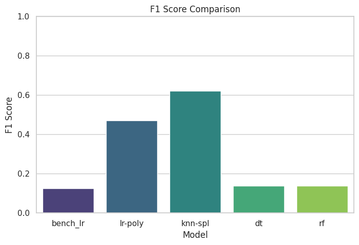
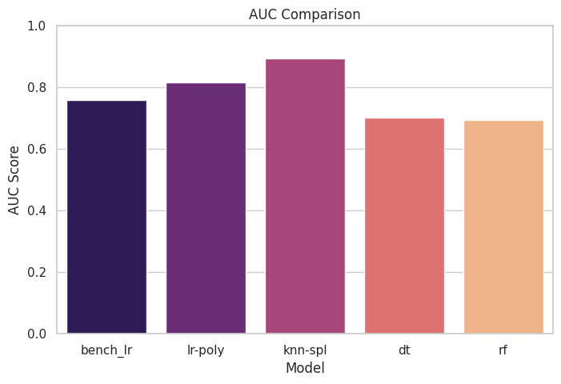
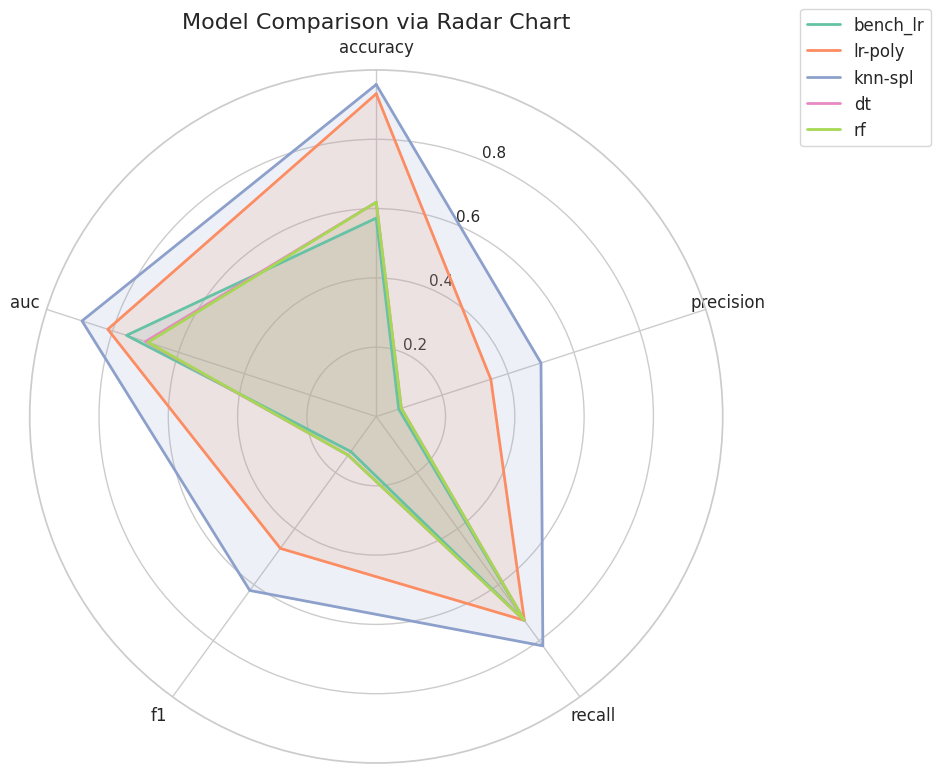
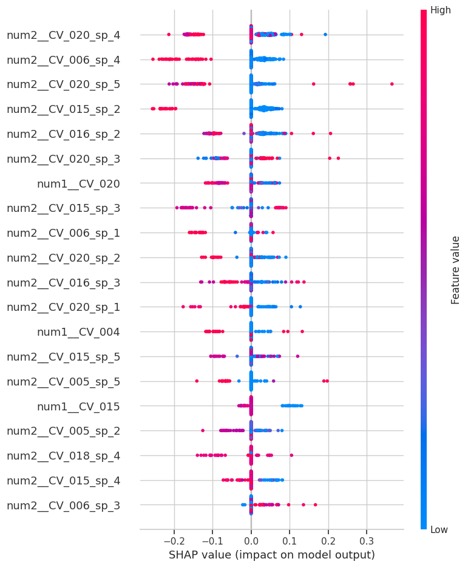

# Injection Molding Defect Classification with Explainable AI Analysis

## 1. Overview
This project develops a machine learning model to classify defective products in an injection molding process. Explainable AI (XAI) techniques are applied to interpret model decisions and identify important process parameters related to product defects.

## 2. Objective
- Classify injection molding products as normal or defective  
- Analyze process patterns from machine sensor data  
- Compare multiple machine learning models for defect detection  
- Improve model transparency using XAI  

## 3. Dataset
- Source: KAMP Injection Molding Dataset  
- Type: Tabular manufacturing process data  
- Samples: 1,323  
- Features: 71 process variables reduced to 22 selected features  
- Task: Binary classification (0 = Normal, 1 = Defect)  

## 4. Data Processing
- Generated defect labels using Statistical Process Control (±2σ rule)  
- Removed product groups with fewer than 10 samples  
- Converted defect labels into binary format  
- Selected representative CV and SV features using correlation analysis  
- Encoded categorical variables using One-Hot Encoding  
- Applied scaling and transformations such as StandardScaler, MinMaxScaler, Polynomial Features, and Spline Transformation  
- Applied Random Oversampling to handle class imbalance  

## 5. Model
- Models tested:
  - Logistic Regression  
  - KNN with Spline Transformation  
  - Decision Tree with Polynomial Features  
  - Random Forest  
  - XGBoost  

- Best-performing model:
  - KNN with Spline Transformation  

## 6. Results

### F1 Score Comparison

### AUC Comparison

### Model Performance (Radar Chart)

- Best Model: KNN-Spline  
- Accuracy: 0.958  
- Precision: 0.50  
- Recall: 0.818  
- F1-score: 0.621  
- ROC-AUC: 0.893  

| Model | Accuracy | Precision | Recall | F1 | AUC |
|------|---------:|----------:|-------:|---:|----:|
| Logistic Regression + Poly | 0.931 | 0.348 | 0.727 | 0.471 | 0.815 |
| KNN + Spline | 0.958 | 0.500 | 0.818 | 0.621 | 0.893 |
| Decision Tree + Poly | 0.973 | 0.700 | 0.636 | 0.667 | 0.812 |
| Random Forest | 0.618 | 0.076 | 0.727 | 0.138 | 0.693 |

## 7. XAI Analysis
### SHAP Feature Importance

- **SHAP:** Used to identify process variables influencing defect predictions  
- Key influential variables include:
  - `CV_020`
  - `CV_006`
  - `CV_015`
  - `CV_016`

These features suggest that nonlinear cycle-related process patterns are important for distinguishing normal and defective products.

## 8. Key Findings
- The dataset is highly imbalanced, with defects representing approximately 4.3% of samples  
- F1-score is more appropriate than accuracy for evaluating defect detection  
- Nonlinear transformations improved model performance  
- KNN with Spline Transformation showed strong overall performance  
- CV features were more informative than most SV features for defect prediction  

## 9. Reproducibility
- Fixed train-test split using stratification  
- Defined preprocessing and feature selection steps  
- Complete machine learning pipeline using scikit-learn  
- Repeated cross-validation for model stability  
- End-to-end executable notebook  

## 10. How to Run
Open the notebook in your preferred environment (e.g., Google Colab, Jupyter Notebook, or Visual Studio Code) and execute all cells sequentially.  
All required steps including data loading, preprocessing, feature engineering, model training, evaluation, and XAI analysis are included within the notebook.

## 11. Tech Stack
Python, Pandas, NumPy, scikit-learn, imbalanced-learn, XGBoost, SHAP, Matplotlib, Seaborn
